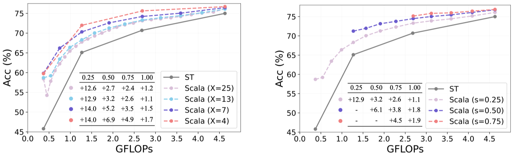

# Slicing Vision Transformer for Flexible Inference (NeurIPS 2024)

    
    
    

Primary contact: [Yitian Zhang](mailto:markcheung9248@gmail.com)

  

## TL,DR
- `Background`: ViTs are the same architecture but only differ in embedding dimensions, a large ViT can be transformed to represent small models by uniformly slicing the weight matrix at each layer, e.g., ViT-B (r=0.5) equals ViT-S.
- `Target`: Broad slicing bound to ensure the diversity of sub-networks; Fine-grained slicing granularity to ensure the number of sub-networks; Uniform slicing to align with the inherent design of ViT to vary from widths.
- `Contribution`: 
    - (1) Detailed analysis of the slimmable ability between different architectures 
    - (2) Propose Scala to learn slimmable representation for flexible inference

## Requirements
- python 3.7
- pytorch 1.8.1
- torchvision 0.9.1
- timm 0.3.2

## Datasets
Please follow the instruction of [DeiT](https://github.com/facebookresearch/deit/blob/main/README_deit.md#data-preparation) to prepare the ImageNet-1K dataset.

## Pretrained Models
Here we provide the pretrained Scala building on top of DeiT-S which are trained on ImageNet-1K for 100 epochs:

| Model | Acc1. ($r=0.25$) | Acc1. ($r=0.50$) | Acc1. ($r=0.75$) | Acc1. ($r=1.00$) |
| ---- | ---- | ---- | ---- | ---- |
| Separate Training  | 45.8% |  65.1% | 70.7% | 75.0% |
| [Scala-S (X=25)](https://drive.google.com/file/d/1-xQFweDA3MUTslDyfs5zqvdRhuRtSN99/view?usp=drive_link)  | 58.4% | 67.8% |  73.1% | 76.2% |
| [Scala-S (X=13)](https://drive.google.com/file/d/1D2KZ5_1VAKB8_NTCH35Xu8IdsIT5i3hB/view?usp=drive_link)  | 58.7% | 68.3% |  73.3% | 76.1% |
| [Scala-S (X=7)](https://drive.google.com/file/d/1DtA21C6VL4Qe8joHXl8yaaLrQ7mbHnEZ/view?usp=drive_link)  | 59.8% | 70.3% |  74.2% | 76.5% |
| [Scala-S (X=4)](https://drive.google.com/file/d/1ZBzFeaMYubr4lBajiyO4QYpzDAG7bp6i/view?usp=drive_link)  | 59.8% | 72.0% |  75.6% | 76.7% |

We also provide Scala building on top of DeiT-B which are trained on ImageNet-1K for 300 epochs:

| Model | Acc1. ($r=0.25$) | Acc1. ($r=0.50$) | Acc1. ($r=0.75$) | Acc1. ($r=1.00$) |
| ---- | ---- | ---- | ---- | ---- |
| Separate Training  | 72.2% |  79.9% | 81.0% | 81.8% |
| [Scala-B (X=13)](https://drive.google.com/file/d/1g58ace9cfFUoooqP6n1Xy0mWqntSGhxE/view?usp=drive_link)  | 75.3% | 79.3% |  81.2% | 82.0% |
| [Scala-B (X=7)](https://drive.google.com/file/d/1LIgPj8TAzmrFvJcQS_QmIyUy8CTDDNeF/view?usp=drive_link)  | 75.3% | 79.7% |  81.4% | 82.0% |
| [Scala-B (X=4)](https://drive.google.com/file/d/1Usy-LevoYqAXdggUT-jvRiWY41Bw93hf/view?usp=drive_link)  | 75.6% | 80.9% |  81.9% | 82.2% |

## Results

- Slicing Granularity and Bound

  

  

- Application on Hybrid and Lightweight structures

  

- Slimmable Ability across Architectures

  

- Transferability
  - **Whether the slimmable representation can be transferred to downstream tasks?** We first pre-train on ImageNet-1K for 300 epochs and then conduct linear probing on video recognition dataset UCF101. We make the classification head slimmable as well to fit the features with various dimensions and the results imply the great transferability of the slimmable representation.
  

    
  

  - **Whether the generalization ability can be maintained in the slimmable representation?** When leveraging the vision foundation model DINOv2 as the teacher network, we follow prior work [Proteus](https://github.com/BeSpontaneous/Proteus-pytorch) and remove all the Cross-Entropy losses during training to alleviate the dataset bias issue and inherit the strong generalization ability of the teacher network. The results are shown in the table and the delivered Scala-B with great generalization ability can be downloaded from the [link](https://drive.google.com/file/d/1KOQQFEhEW3ILASxEp1iW27OM_s1qSPQk/view?usp=drive_link).

  

## Training Scala on ImageNet-1K
1. Specify the directory of datasets with `IMAGENET_LOCATION` in `run.sh`. 
2. Specify the smallest slicing bound $s$ `smallest_ratio`, the largest slicing bound $l$ `largest_ratio` and slicing granularity $\epsilon$ `granularity` to determine $X$ (number of subnets).

| $s$ | $l$ | $\epsilon$ | $X$ |
| ---- | ---- | ---- | ---- |
| 0.25  | 1.0 | 0.03125 |  25 |
| 0.25  | 1.0 | 0.0625 |  13 |
| 0.25  | 1.0 | 0.125 |  7 |
| 0.25  | 1.0 | 0.25 |  4 |

3. Run `bash run.sh`.

## Flexible inference at different width ratios
1. Specify the directory of datasets with `IMAGENET_LOCATION` and the pretrained model with `MODEL_PATH` in `eval.sh`. 
2. Specify the width ratio with `eval_ratio` in `eval.sh`.
3. Run `bash eval.sh`.